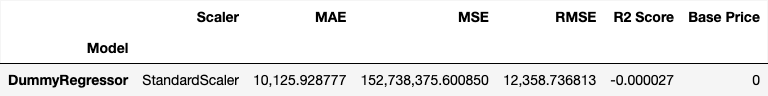
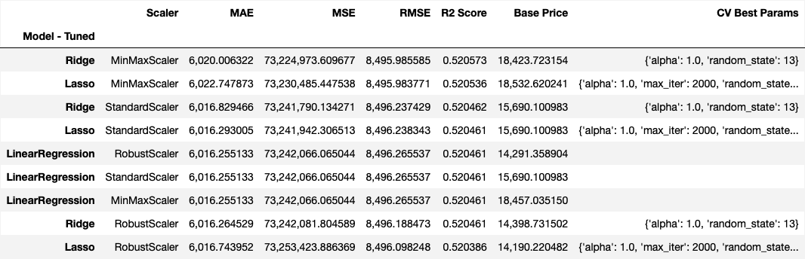
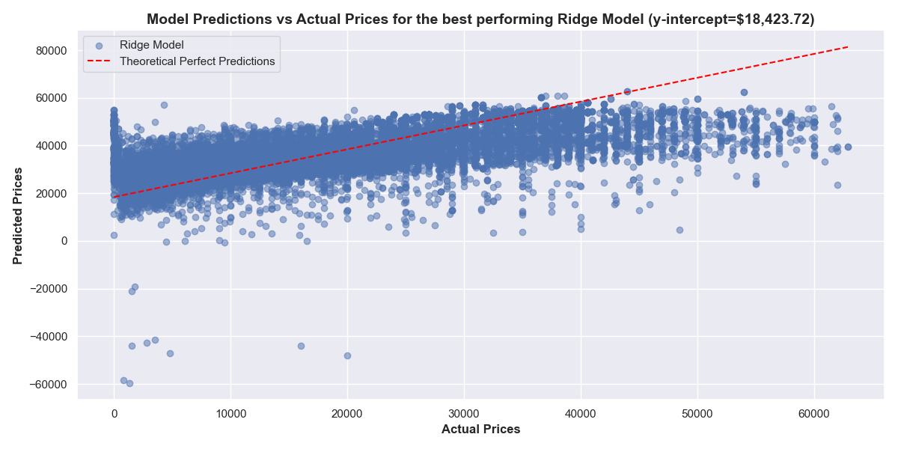
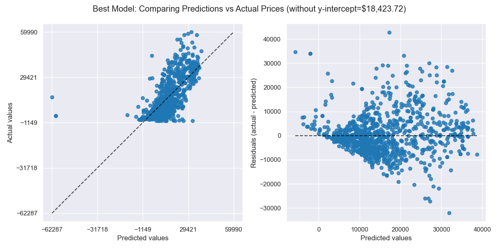
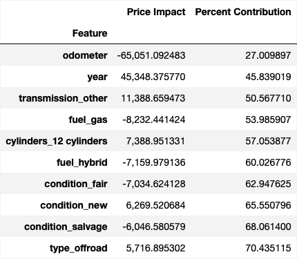
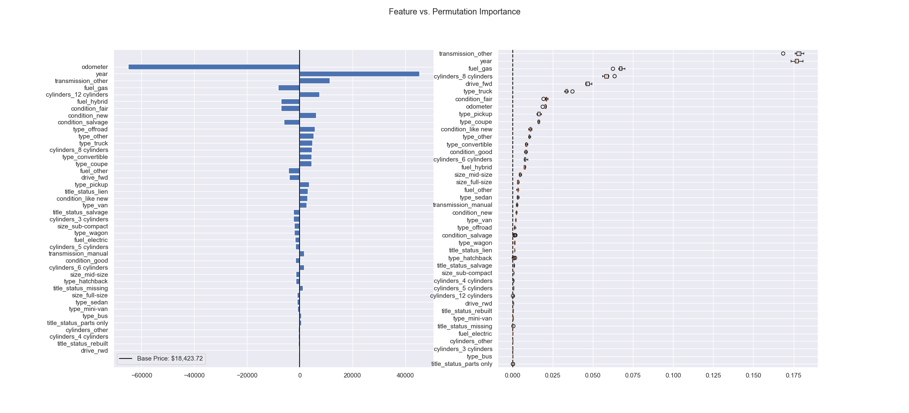
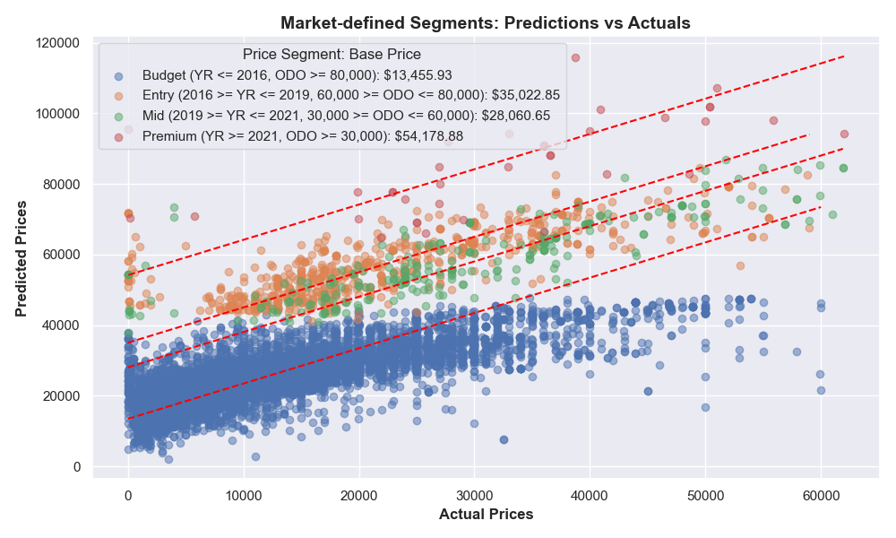

# What drives the price of a car?
<table style="width:100%"><tr><td width="100%">
  
</td></tr></table>

Practical Application II 
UC Berkeley ML/AI Professional Certification coursework 
Fazeel Mufti

  
**Resources**

* `data/vehicles.csv`: You can download this file to play with the data yourself
* `PricingModelReport.ipynb`: Jupyter notebook containing the PricingModel and associated Report - summarized here in the Executive Summary
* `DataInvestigation.ipynb`: Jupyter notebook containg the exploratory data analysis done for the Pricing Model Report - summarized here in the Executive Summary
* `utils_practical_2.py`: Python code supporting Jupyter notebooks

## Context
This was the second Practical Application Project as part of my UC Berkeley ML/AI Professional Certification coursework.

There were three requirements for this project:

1. Evaluate Linear Regression models for predicting prices for the provided dataset based on the above prompt
1. Use the CRISP-DM Framework as the basis for the project breakdown and deliverables
1. Provide a business-friendly report for our clients at the used car dealership

Here's the assignment prompt:

> In this application, you will explore a dataset from kaggle. The original dataset contained information on 3 million used cars.
> The provided dataset contains information on 426K cars to ensure speed of processing. Your goal is to understand what
> factors make a car more or less expensive. As a result of your analysis, you should provide clear recommendations to your
> client -- a used car dealership -- as to what consumers value in a used car.
>
>To frame the task, throughout these practical applications we will refer back to a standard process in industry for data
> projects called CRISP-DM. This process provides a framework for working through a data problem. Your first step in
> this application will be to read through a brief
> [overview of CRISP-DM](https://mo-pcco.s3.us-east-1.amazonaws.com/BH-PCMLAI/module_11/readings_starter.zip).
>
> Data:
> You will work with a used cars dataset `data/vehicles.csv`.
>
> Deliverables:
> After understanding, preparing, and modeling your data, write up a basic report that details your primary findings.
> Your audience for this report is a group of used car dealers interested in fine-tuning their inventory.

The Executive Summary provides the Plain Langauge Report for the customer detailed in the two Jupyter Notebooks.

## Executive Summary

### Business Understanding

The dataset provided by the customer contains prices for 426,880 used cars along with 17 attributes for each vehicle. The 
business objectives for the project are:

1. Provide a price prediction model driven by the feature data
2. Explain which vehicle features drive the price of the car

We will use the `price` column as the **target or dependent variable**, along with the other feature columns, the **independent 
variables**, as  inputs to a set of LinearRegression models that will use the inputs to predict the price for each vehicle. 
Each model will be evaluated on the accuracy of its prediction and the best performing model will be used to _interpret 
the relative importance of each input features to the price_. To objectively measure each model, the data will be divided 
into a **training** (80%) and a **test set** (remaining 20%). All the models will be trained on the same training set, and will 
be evaluated against the Test data with known prices. Before training the models, we will remove noise and incomplete information 
from the dataset so the models can be trained optimally.

### Data Understanding

**An exploratory data analysis was performed on the Customer dataset and this section summarizes the findings detailed 
in the companion [`DataInvestigation.ipynb`](DataInvestigation.ipynb) notebook**:

Looking at our `price` target variable, we find:

* There are 32,895 cars with a zero price, 7.71% of the total (426,880)
* The price distribution shows an extreme right-skew and a long-tail with a few outliers beyond \\$100K price point
  
<table style="width:100%" align="center"><tr ><td width="100%">
  
</td></tr></table>

While investigating the target and independent features of our dataset during the Data Investigation, we learnt that the data is very noisy with extreme outliers. Based on my findings, the `get_cleansed_data()` Python function was created, which: 

* Reads the input dataset
* Remove null data and outliers
* Removes unnecessary features like ID, Model and VIN that are specific to individual cars, and are not useful for the kind of machine-learning algorithms that we will be using
* Transforms the datatypes to standard Python types that are more conducive for our regression models

In summary, 66,180 samples were dropped, preserving 84.50% of the original data. It is important to note that we were able to preserve a good portion of high-quality data with `price` information. This gives us a good starting point.

Please refer to the `DataInvestigation` for more details - we will use this information to guide our data modeling and optimization.

## Modeling 

We used the following standard linear regression models to train our data:

* LinearRegression Model: Provides a baseline for a commercial-strength model, but with no regularization. It should perform well if our dataset is not prone to overfitting
* Lasso (L1 Regularization) Model: Helpful in eliminating less important features, and can be used for feature selection
* Ridge (L2 Regularization) Model: Often performs better than linear regression when multicollinearity is present, as it penalizes large coefficients

In order to find the most suitable model for our data, we used the following procedure to find the best model:

* Hyperparameter Tuning: GridSearchCV is used to find the best alpha parameter for Ridge and Lasso models. The grid search is performed with 5-fold cross-validation
* Cross-validation: cross_val_score is used to evaluate the models' performance with cross-validation, providing a more robust estimate of model performance
* Model Evaluation: The models are evaluated using Mean Absolute Error (MAE), Mean Squared Error (MSE), and R-squared metrics on the test set
* Scaling: Use different scaling techniques to bring all the features closer to a similar or same range or scale, so they contribute equally to price prediction. Some models also converge quicker with scaled data
  * StandardScaler: Results in a distribution with 0 mean and 1 standard deviation. Sensitive to outliers
  * MinMaxScaler: Restricts value range to [0,1]. Sensitive to outliers
  * RobustScaler: Removes the median and uses the interquartile range (IQR) as a reference point for scaling. It is not affected by outliers

RESULTS: Baseline metrics without any optimization (Sorted: max(R2), min(MAE)
<table style="width:100%" align="center"><tr ><td width="100%">
  
</td></tr></table>

RESULTS: Optimized Model results after hyperparameter tuning and cross-validation (5-fold): Sorted max(R2), min(MAE)
<table style="width:100%" align="center"><tr ><td width="100%">
  
</td></tr></table>

**Best Model with highest R2 Score: Ridge**
* Best Params: {'alpha': 100.0, 'random_state': 13}
* Scaler: StandardScaler
* R2 Score: 52.07%
* RMSE: $8,496.24
* Base Price (y-intercept): $15,690.10

We see that all the models performed very closely without any clear winners, with **the best R2 score of 52.07% from the tuned Ridge regression model**. Compared to the `DummyRegressor` as our baseline where (R2 = 0) it performed the same as simply predicting the mean of all prices, our tuned Ridge model explains 52% of the variability when predicting the car price from the features, with a standard deviation of $8,496.24 (RMSE: root mean squared error) from the actual price. This is a good start!

We can also make the following observations:

* The base price of a car is given by the y-intercept for the linear regression model: $15,690.10
* Each training feature contributes to the predicted price based on the weights for that specific feature that the model has learned from the training data - we will investigate this further later

**_We will use the best performing Ridge model as the basis of our evaluation from this point forward_**.

### Visualizing Actual vs Predicted Prices

<table style="width:100%" align="center"><tr ><td width="100%">
  
</td></tr></table>

The red line represents the ideal case if all our predictions perfectly matched the actual prices. From the scatter plot above, we can see that our model has learnt the basic pricing relationship from our features but is not performing well on the top and bottom of the price range.

### PredictionErrorDisplay: Residuals Comparison

<table style="width:100%" align="center"><tr ><td width="100%">
  
</td></tr></table>

The graph on the left is showing us that for the high-end, the prediction error increases from the perfect center line. Ideally, the scatter points would hug the diagonal. The graph on the right shows us the residuals, the difference between the actual and the predicted value, and shows us that the model is performing better in the middle price ranges. 

Taken together, this shows us that we should perhaps use non-linear regresssion methods for this dataset to capture the variation on each end of the price spectrum. However, for the purpose of this study, we're deliberately restricting ourselves to linear regression models to learn more about them.

### Interpreting the Best Model Results: Feature & Permutation Importance

We now use **Feature Importance** to interpret the results of the best performing model and analyze the coefficients, or weightings, for each feature that were _learnt_ by our model during the training process. This represents the causal relationship between that feature and the price of the vehicle, or the importance of that feature to the price prediction. 

In addition, we also calculate the **Permutation Importance** to measure the change in our model's performace when a feature value is randomly shuffled to see how much the model relies on that feature for its predictions. This will help us determine collinearity between features not captured by the model cofficients and evaluate the impact of changing the feature on the model performance.

<table style="width:100%"><tr>
  <td width="500%"></td>
  <td width="500%"></td>
</tr></table>

<table style="width:100%" align="center"><tr ><td width="100%">
  
</td></tr></table>

### Feature Elimination & Optimization

From the feature importance provided by the trained model on the left, we can see the top features that capture upto 85% of the price variation, and individually represent the impact to price when there is a one-unit change in the corresponding feature. For example, our model is aware of the different `condition` values when predicting prices, with `condition_fair` negatively impacting price and `condition_new` positively impacting price.

Based on the above side-by-side comparison of the feature and permutation importance, we can see that a majority of the price is determeined by a relatively few features. Taking a look at the features that drive 85% of the price variance, the following features stand out, with different values impacting the price:

* Odometer
* Year
* Condition
* Transmission
* Type
* Drive
* Fuel
* Cylinders

Based on the permutation importance, `year` pops to the top of the list. These results are intuitive and make sense from what we consider to be important considerations when pricing a used car.

The other features can be eliminated as they are mostly colinear and detract from the accuracy score.

Interestingly:

* `title_status` was eliminated likely due to the vast majority of the cars having a 'clean' title
* `size` is likely being over-shadowed by `transmission` and `cylinders` due to colinearity

Let's run the best model again after removing the unnecessary features: `title_status`, `size`.

I also decided to set the following cutoffs to get a more realistic inventory for re-trainig our best model:

* Odometer: Restricted to milage between 0 and 250,000 miles
  * Removed 232 low milage cars (0.19% of total) and 5,554 high-milage cars (4.53% of total)
* Year: Removed 2,973 cars (2.42% of total) older than the 1980 model year

<table style="width:100%" align="center"><tr ><td width="100%">
  
</td></tr></table>

Now, we're ready to re-train the model and analyze the results.

<table style="width:100%" align="center"><tr ><td width="100%">
  
</td></tr></table>

We can see from the graph and the results table that our best Ridge Model really improved dramatically after optimization from 52.07% R2 score to 71.07%. In addition, the Average Price across all predictions is a more realistic $30,531.

RESULTS: Optimized Features: Predictions vs Actuals
<table style="width:100%" align="center"><tr ><td width="100%">
  
</td></tr></table>

## Model Applications: Segment Analysis

Now that the model has been re-trained, we can validate it using some of the findings from our data investigation where we found different ways to segment the pricing data. We will use our optimized model to predict prices for cars in these segments and see how our model performs. Please note that these new test segments includes cars from both the training and test sets, and we want to use this exercise as examples of interesting application of our Pricing Model.

### Market Defined Segments: Pricing Guidance
We will now run the Pricing Model against a test set defined on the following market-based classification of our cars:

* Budget: Model Year <= 2016 and Odometer >= 80,000
* Entry: Model Year between 2016 and 2019, Odometer between 60,000 and 80,000
* Mid: Model Year between 2020 and 2021, Odometer between 30,000 and 60,000
* Premium: Model Year newer than 2021, Odometer less than  30,000

This is typical of how used cars are categorized on the dealer lot. Let's see how we do! 

<table style="width:100%" align="center"><tr ><td width="100%">
  
</td></tr></table>

RESULTS: Market-defined Segments: Predictions vs Actuals
<table style="width:100%" align="center"><tr ><td width="100%">
  
</td></tr></table>

As we can see, our model scores fairly well for the first three segments and is able to predict reasonable average prices for each segment. This is an example of using the Pricing Model in **Pricing Guidance** use cases for new inventory, where sales agents can input the vehicle features into the model to get suggested prices.

### Price-based Segments: Sale Price Validation

Next, we define a test set based on the following price-based classification of the cars:

* Low-priced cars: Price < 5,000
* Mid-priced cars: Prices between 5,000 and 50,000
* High-priced cars: Price above 50,000

<table style="width:100%" align="center"><tr ><td width="100%">
  
</td></tr></table>

RESULTS: Price-based Segments: Predictions vs Actuals
<table style="width:100%" align="center"><tr ><td width="100%">
  
</td></tr></table>

We see that our model performs even better (73.98%) for the mid-priced range than what we have seen so far. For low- and hi-priced cars, there is likely insufficient data to model these cases. This gives us confidence that we can use this model to build a model to classify newly acquired inventory into the market-based segments from the previous Pricing Guidance example.
