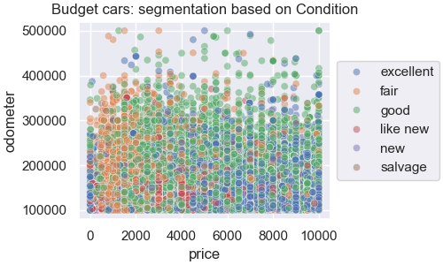

# What drives the price of a car?
<table style="width:100%">
<tr>
<td width="100%">
  
</td>
</tr>
</table>

<p align='right'>
Practical Application II<br>
UC Berkeley ML/AI Professional Certification coursework<br>
Fazeel Mufti
</p>
  
**Resources**

* `data/vehicles.csv`: You can download this file to play with the data yourself
* `PricingModelReport.ipynb`: Jupyter notebook containing the PricingModel and associated Report - summarized here in the Executive Summary
* `DataInvestigation.ipynb`: Jupyter notebook containg the exploratory data analysis done for the Pricing Model Report - summarized here in the Executive Summary
* `utils_practical_2.py`: Python code supporting Jupyter notebooks

## Context
This was the second Practical Application Project as part of my UC Berkeley ML/AI Professional Certification coursework.

There were three requirements for this project:

1. Evaluate Linear Regression models for predicting prices for the provided dataset based on the above prompt
1. Use the CRISP-DM Framework as the basis for the project breakdown and deliverables
1. Provide a business-friendly report for our clients at the used car dealership

Here's the assignment prompt:

> In this application, you will explore a dataset from kaggle. The original dataset contained information on 3 million used cars.
> The provided dataset contains information on 426K cars to ensure speed of processing. Your goal is to understand what
> factors make a car more or less expensive. As a result of your analysis, you should provide clear recommendations to your
> client -- a used car dealership -- as to what consumers value in a used car.
>
>To frame the task, throughout these practical applications we will refer back to a standard process in industry for data
> projects called CRISP-DM. This process provides a framework for working through a data problem. Your first step in
> this application will be to read through a brief
> [overview of CRISP-DM](https://mo-pcco.s3.us-east-1.amazonaws.com/BH-PCMLAI/module_11/readings_starter.zip).
>
> Data:
> You will work with a used cars dataset `data/vehicles.csv`.
>
> Deliverables:
> After understanding, preparing, and modeling your data, write up a basic report that details your primary findings.
> Your audience for this report is a group of used car dealers interested in fine-tuning their inventory.

The Executive Summary provides the Plain Langauge Report for the customer detailed in the two Jupyter Notebooks.

## Executive Summary

### Business Understanding

The dataset provided by the customer contains prices for 426,880 used cars along with 17 attributes for each vehicle. The 
business objectives for the project are:

1. Provide a price prediction model driven by the feature data
2. Explain which vehicle features drive the price of the car

We will use the `price` column as the **target or dependent variable**, along with the other feature columns, the **independent 
variables**, as  inputs to a set of LinearRegression models that will use the inputs to predict the price for each vehicle. 
Each model will be evaluated on the accuracy of its prediction and the best performing model will be used to _interpret 
the relative importance of each input features to the price_. To objectively measure each model, the data will be divided 
into a **training** (80%) and a **test set** (remaining 20%). All the models will be trained on the same training set, and will 
be evaluated against the Test data with known prices. Before training the models, we will remove noise and incomplete information 
from the dataset so the models can be trained optimally.

### Data Understanding

**An exploratory data analysis was performed on the Customer dataset and this section summarizes the findings detailed 
in the companion [`DataInvestigation.ipynb`](DataInvestigation.ipynb) notebook**:

Looking at our `price` target variable, we find:

* There are 32,895 cars with a zero price, 7.71% of the total (426,880) - these are candidates for exclusion pending further analysis
* The price distribution shows an extreme right-skew and a long-tail with a few outliers beyond \\$100K price point
  


* Analyzed outliers using two separate methods (quantile analysis and Modified z-score)
    * ModZ performed better, i.e. preserved more data samples - removing only 5,790 instead of 8,177 priced vehicles
* Looking at the distribution of priced cars, i.e. cars in the sample dataset that have pricing informaion:
    * There seems to be **at least a low- and mid-price band with a long tail that represents high-priced autos**

Based on Price inspection, a potential hypothesis arose that the used car inventory is _segmented_ based on the following price bands:


In addition, I did some market research on used car sales for 2023 to learn more about this domain:

> [Auto Remarketing, July 2023: Mid-Year Market Report: Dissecting used-car pricing, segment trends, CPO sales & more](http://digital.autoremarketing.com/publication/frame.php?i=794065&p=&pn=&ver=html5&view=articleBrowser&article_id=4594802)
>
>    * "Average used vehicle transaction price in the first quaretr actually dipped by 6.4% year-over-year to $28,381, compared to $30,329 in Q1 2022"

Though we don't have year-over-year sales information in this dataset, market research suggests that typical used cars 
can be categoriezed into price ranges like Budget, Mid, Luxury, etc. that will be based on feature groups. I looked 
at ```<price, year, condition, odometer>``` combinations and saw that there was clustering behavior as shown by the scatter plots below:

<table style="width:100%">
<tr>
<td width="50%">
  
</td>
<td width="50%">
  
</td>
</tr>
</table>

Please refer to the `DataInvestigation` for more details, but we will use this information to guide our data modeling and optimization.

